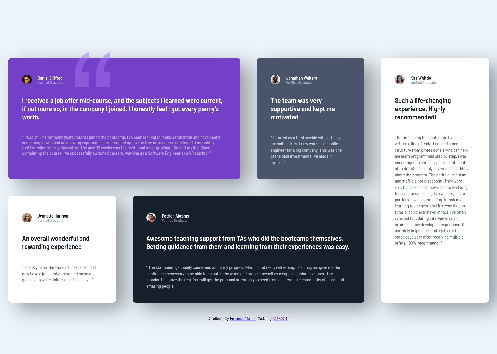

# Frontend Mentor - Testimonials grid section solution

This is a solution to the [Testimonials grid section challenge on Frontend Mentor](https://www.frontendmentor.io/challenges/testimonials-grid-section-Nnw6J7Un7). Frontend Mentor challenges help you improve your coding skills by building realistic projects. 

## Table of contents

- [Overview](#overview)
  - [The challenge](#the-challenge)
  - [Screenshot](#screenshot)
  - [Links](#links)
- [My process](#my-process)
  - [Built with](#built-with)
- [Author](#author)

## Overview

### The challenge

Users should be able to:

- View the optimal layout for the site depending on their device's screen size using Sass.

### Screenshot

### Links

- Solution URL: [Add solution URL here](https://your-solution-url.com)
- Live Site URL: [Add live site URL here](https://your-live-site-url.com)

## My process
I started by structuring the project in HTML and defining the card classes.
Starting from mobile-first, I created the first card and then the mixins with what would be standard on the other cards.
Then I created the partials and implemented the mixins and individual characteristics.
It was very difficult, but I managed to position the quote decoration on the first card.
I then moved to the Desktop, applying the breakdown for screens larger than 940px and then the display grid on the body. 
Then I positioned the cards as the challenge requires. I finished the cards by applying the box-shadow

### Built with

- Semantic HTML5 markup
- CSS custom properties
- Flexbox
- CSS Grid
- Mobile-first workflow
- Sass

## Author

- Website - [Portifólio](https://my-page-portifolio.vercel.app/)
- Frontend Mentor - [@M4R0C4](https://www.frontendmentor.io/profile/M4R0C4)
- LinkedIN - [Mariana Candido](https://www.linkedin.com/in/mariana-candido-20b59b88)
